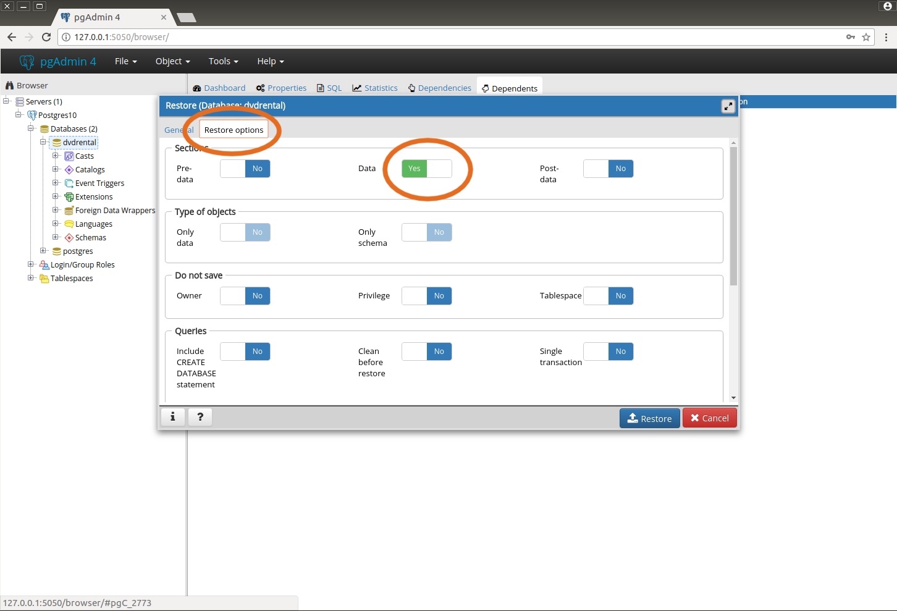

# pgAdmin 4

This is a basic docker image for running pgAdmin 4 in a container. The default configuration is intended for playing with SQL datasets and it is not intended for production (it runs in "desktop" mode and authentication is disabled).

## Requirements

- Docker
- docker-compose

# Getting started

To run the pgAdmin4 docker image you just need to call `docker-compose up` (or `make up`) to start the service with postgres and pgadmin4.

Then, you must open a browser tab and go to `0.0.0.0:5050` or `127.0.0.1:5050` to start using the pgAdmin service.

> Note: If you start the service via `localhost:5050` you'll receive an error on the form **Query Tool Initialize Error** when trying to use the query tool. This is an issue with pgadmin v3.0 and, as soon as a fix is provided, I'll update this repository accordingly.

## Setting up a dataset

To create a dataset you first need to set up a server to connect to the postgres service. For that, you'll need to (1) set a server connection to the postgres service and (2)create a database (and (3) load data from a file).

The following subsections will show you how to set up these steps in order to use pgAdmin for querying data.

### Set up a connection to the postgres service

1. Right click on the `Servers` in the left side-bar and create a server;

2. A popup window will appear. In the **General** tab, enter a name for the server (for example, *Postgres10*);

")

3. In the **Connection** tab, add the following string to the Host name/address: `postgres`;

4. Set the password field to `postgres` (optional: click the **Save password?** checkbox to avoid typoping the password everytime you start pgadmin);

5. Save the settings.

### Create a database

1. In the previously created server connection, right click on the `Databases` field and click on Create -> Database;

2. Give a name to the database and click on save.

A database will be created and you should see a sucess message appear in the bottom-right corner of the screen.

### Load/restore data of a database

Loading data into a database can be done by following the next steps. Before doing so, you must copy the file of the database you want to load into a directory in the  root dir of this repository with the name `data/`. After you've copied a data file into this directory, do the following steps to load the data to postgres:

1. On the database you've previously created, right click on its name under Databases and select the `Restore` option;

2. A popup window will open. Click on the **...** icon in the right side of the **Filename** field;

3. This will opean another window and you'll travel to the `/home/` directory. This is where the data file stored in the `data` dir is located. To visualize it, select the **All Files** option in the dropdown box in the bottom right corner;

4. Select the file you want to load and click on **Save**.

5. Next, in the **Restore options** tab, click on the **Data** box and set it to `yes` and then click on **Restore**;

> Note: You'll see in the bottom right corner a success message if the database restoration has been done successfully.

6. Finally, right click on the database you've restored and click on **Refresh** in order to see the changes done to the database.

## Querying a database

Querying a database is easy:

1. Select the database you want to query;

2. Right click on the database and select the **Query Tool** option;

> Note: If it is giving the error **Query Tool Initialize Error**, you'll need to connect to pgAdmin via `0.0.0.:5050` or `127.0.0.1:5050`. pgAmin v3.0 is having an issuing when using `localhost:5050` to connect to the service.

3. Write an SQL statement and click on the symbol to run it.

## Acknowledgements

This repository is based on @thaJeztah's [pgadmin4-docker](https://github.com/thaJeztah/pgadmin4-docker).
